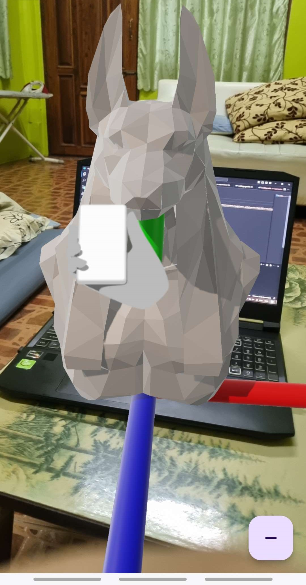

## ทำอะไรมาก่อนหน้า
- ใช้โมเดลจาก web url
     
    

## วันนี้ทำอะไร
- ดึงโมเดลจาก web url มาไว้ใน local storage แล้วค่อยมาใช้
    <u>จะได้เพิ่มหน้าโหลดก่อนได้ง่าย</u>
- เพิ่มปุ่มที่จะขยับโมเดล

## ติดปัญหาอะไร
- Postgres ใช้ยังไม่เป็น