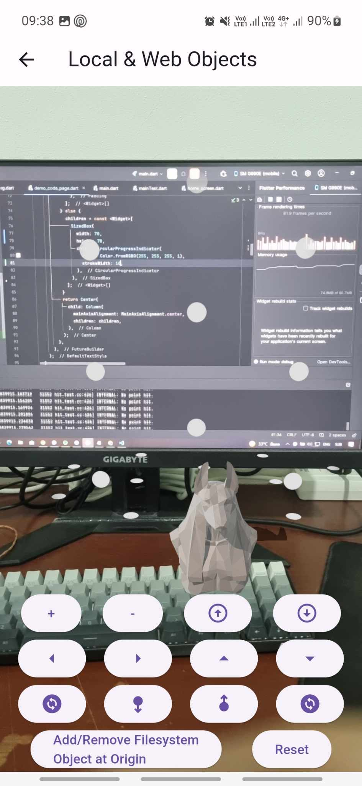

## ทำอะไรมาก่อนหน้า
- ดึงโมเดลจาก web url มาไว้ใน local storage แล้วค่อยมาใช้
    <u>จะได้เพิ่มหน้าโหลดก่อนได้ง่าย</u> `Done`
- เพิ่มปุ่มที่จะขยับโมเดล `Done`
- เพิ่มปุ่มหมุนโมเดล `Done`
- เพิ่มปุ่มลดขยายโมเดล `Done`

## วันนี้ทำอะไร
- ทำ demo page สำหรับการเอาไปใช้ต่อ
     
    
- ทำหน้า load ระหว่าง load model
     
    
- ทำหน้า error loading
     
    

## ติดปัญหาอะไร
